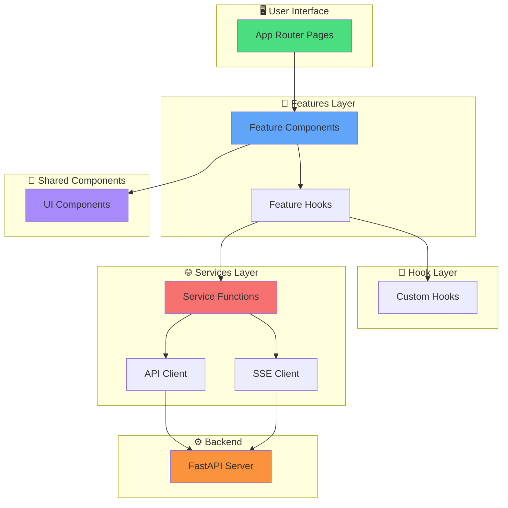
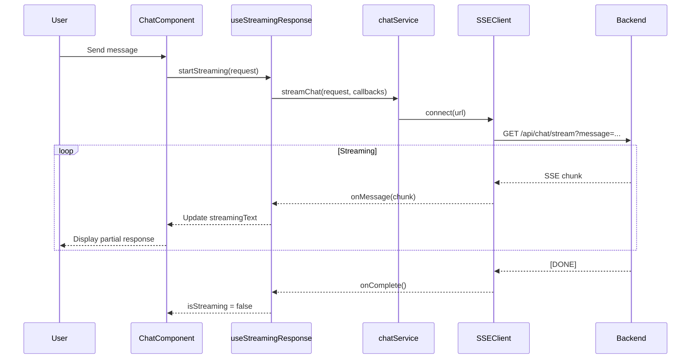

# DocuMind Frontend - Architecture Diagram

## Folder Structure

```
frontend/
└── src/
    ├── app/                    # ⚡ Next.js App Router (Routes & Layouts)
    │   ├── layout.tsx
    │   ├── page.tsx           # Dashboard
    │   ├── documents/
    │   │   └── page.tsx       # Document management
    │   └── chat/
    │       └── [documentId]/
    │           └── page.tsx   # Chat interface
    │
    ├── features/              # 🎯 Feature Modules (Business Logic)
    │   ├── documents/
    │   │   ├── components/    # DocumentUpload, DocumentList, DocumentCard
    │   │   └── hooks/         # useDocuments
    │   │
    │   └── chat/
    │       ├── components/    # ChatInterface, MessageList, StreamingMessage
    │       └── hooks/         # useChat, useStreamingResponse
    │
    ├── services/              # 🌐 API Layer (Backend Communication)
    │   ├── api.ts            # Axios base client
    │   ├── sse-client.ts     # Server-Sent Events utility
    │   ├── documents.service.ts
    │   ├── chat.service.ts   # ⚡ SSE streaming support
    │   └── conversations.service.ts
    │
    ├── hooks/                 # 🎣 Global Custom Hooks
    │   ├── useApiError.ts
    │   └── useDebounce.ts
    │
    ├── components/            # 🧩 Atomic UI Components (No Business Logic)
    │   ├── ui/
    │   │   ├── Button.tsx
    │   │   ├── Input.tsx
    │   │   ├── Card.tsx
    │   │   ├── Badge.tsx
    │   │   └── Spinner.tsx
    │   └── layout/
    │       ├── Header.tsx
    │       └── Sidebar.tsx
    │
    ├── lib/                   # 🛠️ Utilities & Helpers
    │   ├── utils.ts
    │   └── constants.ts
    │
    └── types/                 # 📘 TypeScript Definitions
        ├── document.ts
        ├── chat.ts
        └── api.ts
```

## Data Flow Architecture



## Chat Streaming Flow (SSE)



## Component Hierarchy Example

```
📄 app/chat/[documentId]/page.tsx
    └── 🎯 features/chat/components/ChatInterface.tsx
        ├── 🎯 features/chat/components/MessageList.tsx
        │   └── 🎯 features/chat/components/StreamingMessage.tsx
        │       ├── 🧩 components/ui/Card.tsx
        │       └── 🧩 components/ui/Badge.tsx (for citations)
        │
        └── 🎯 features/chat/components/MessageInput.tsx
            ├── 🧩 components/ui/Input.tsx
            └── 🧩 components/ui/Button.tsx
```

## Separation of Concerns

| Layer | Responsibility | Example |
|-------|----------------|---------|
| **App** | Routing, layouts, page shells | `app/chat/[documentId]/page.tsx` |
| **Features** | Business logic & domain components | `features/chat/hooks/useChat.ts` |
| **Services** | API communication only | `services/chat.service.ts` |
| **Hooks** | Reusable stateful logic | `hooks/useApiError.ts` |
| **Components** | Pure UI, no business logic | `components/ui/Button.tsx` |
| **Lib** | Pure functions, utilities | `lib/utils.ts` |
| **Types** | TypeScript definitions | `types/chat.ts` |

## Key Technologies

- **Next.js 16** - App Router, React Server Components
- **React 19** - Latest features, concurrent rendering
- **TypeScript** - Full type safety
- **Tailwind CSS 4** - Utility-first styling
- **Axios** - HTTP client
- **EventSource** - SSE streaming (native browser API + polyfill)

## Why This Architecture?

✅ **Scalable**: Easy to add new features without touching existing code  
✅ **Maintainable**: Clear boundaries between layers  
✅ **Testable**: Each layer can be tested independently  
✅ **Type-Safe**: TypeScript throughout  
✅ **DRY**: Shared components and hooks prevent duplication  
✅ **SSE-First**: Built for real-time streaming from day one
